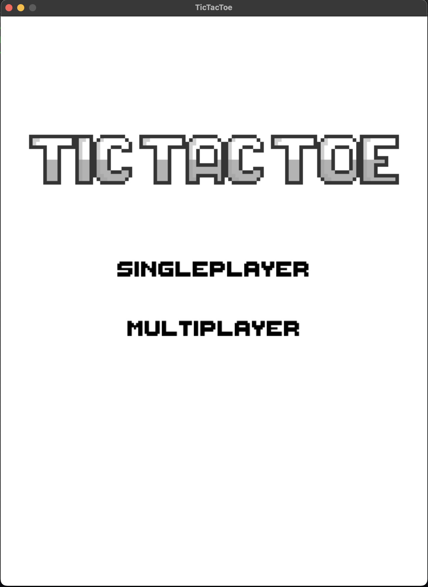
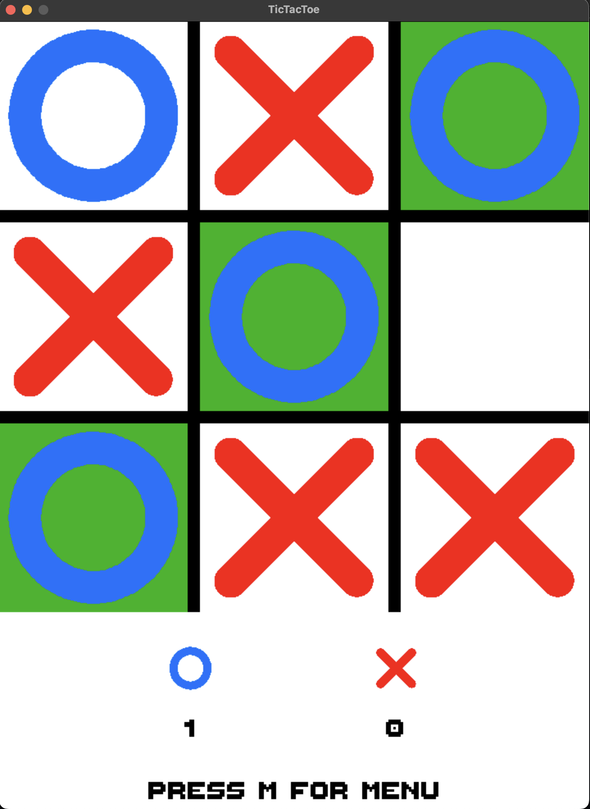

# SDL2-TicTacToe
TicTacToe game written using SDL2 library, State pattern featuring 2 game modes - Singleplayer using basic minimax algorithm for AI and multiplayer.

Compiled with provided Makefile.

